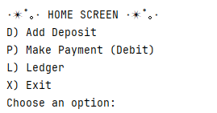
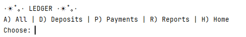
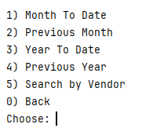
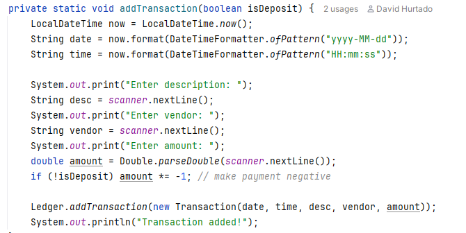

# Accounting Ledger Application

This is my **Capstone 1 Project** for the *Java Development Fundamentals* course in the Year Up United Java Focus Academy.  
The Accounting Ledger Application is a simple program written in Java that allows users to track deposits, payments, and run basic financial reports.

---

## Features

- Add deposits or payments (debits)
- Automatically store transactions in `transactions.csv`
- View all entries, only deposits, or only payments
- Run basic reports:
    - Month-to-date
    - Previous month
    - Year-to-date
    - Previous year
    - Search by vendor name
- Transactions display newest first

---

## Screenshots

### Home Screen

### Ledger Screen

### Reports Screen

## Interesting Piece of Code

Below is a small snippet that handles adding a new transaction and saves it automatically to the CSV file:

This block:
* Gets the current date and time
* Prompts the user for input
* Automatically saves it to the CSV file